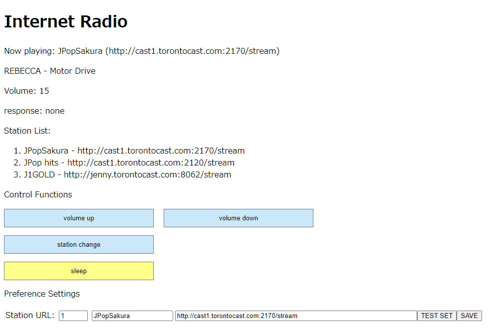

<H3>ESP32S3によるインターネットラジオ</H3>

MP3ストリームをI2Sデータへデコードできる<a href="https://github.com/schreibfaul1/ESP32-audioI2S">ライブラリ</a>を利用した簡単構成のインターネットラジオです。 
ESP32S3とI2S DAC、表示装置があれば製作できます。コードは<a href="https://wiki.seeedstudio.com/xiao_esp32s3_getting_started/">Seeed Studio XIAO ESP32S3</a>に対応しています。 
Webサーバーを搭載しているので、ブラウザから操作できます（タクトスイッチはオプション）。 
Arduino IDE（2.1.0）と<a href="https://github.com/espressif/arduino-esp32">ESP32開発環境（2.0.17）</a>が必要です。

<strong>特長</strong> 
 ・構成が簡単で安価。 
 ・WiFi接続。 
 ・MP3ストリームのインターネットラジオ局を受信できる。 
 ・ブラウザから操作できる（応答を確認しながらゆっくりと操作する）。タクトスイッチの接続も可能（コード上の定義はしてある）。 
 ・ブラウザにアーティスト名、曲名が表示（日本語可）される（表示装置では日本語は不可）。 
 ・インターネットラジオ局の設定はプリセットまたはURLを入力設定（設定は保存される）。 
 ・時刻表示（1,2行目に切り替え表示）とスリープタイマー（６０分）付き。スリープタイマーの残り時間は表示装置の1行目に表示（SLPmm）される。 

<strong>H/W構成</strong> 
 ・Seeed Studio XIAO ESP32S3（他のESP32S3ではGPIOの接続を変更すれば動作する可能性あり） 
 ・<a href="xiao_esp32s3_pcm5102_uda1334.JPG">UDA1334 I2S DAC ブレークアウト基板 またはPCM5102 I2S DAC ブレークアウト基板</a> 
   注意点として、PCM5102基板の裏面に<a href="xiao_esp32s3_jumper.JPG">1から4のハンダ_ジャンパー</a>があり、設定(3はH、他はL)しておく必要があるが、ハンダブリッジが無い基板もある。 
   なおPCM5102はスピーカーを鳴らすにはパワー不足。UDA1334は小音量で良いならOK。 
 ・SD1306 128x64 OLED表示装置 

※基板はXIAO ESP32S3とI2C対応の物を流用。正常動作時は黄LEDが約４秒間隔で点滅、写真ではタクトスイッチは未接続

<strong>操作</strong> 
 ・プリセットしたインターネットラジオ局の切り替え（ブラウザ／タクトスイッチ）。 
 ・音量調整（ブラウザ／タクトスイッチ）。 
 ・スリープタイマーのON/OFF（ブラウザ／タクトスイッチ）。 
 ・インターネットラジオ局のURL入力、設定（テスト）と保存（ブラウザ）。 

<strong>接続</strong> 

各コンポーネントの接続は以下の通り。 

I2S DAC
<table> 
<tr>
<td>I2S DAC(UDA1334)&nbsp;</td><td>I2S DAC(PCM5102)&nbsp;</td><td>ESP32S3</td>
</tr>
<tr>
<td>VIN</td><td>VIN</td><td>3V3</td>
</tr>
<tr>
<td>GND</td><td>GND</td><td>GND</td>
</tr>
<tr>
<td>WSEL</td><td>LCK</td><td>GPIO9</td>
</td>
<tr>
<td>DIN</td><td>DIN</td><td>GPIO3</td>
</tr>
<tr>
<td>BCLK</td><td>BCK</td><td>GPIO7</td>
</tr>
<tr>
<td>-</td><td>SCK</td><td>GND</td>
</tr>
</table>

I2C 表示装置
<table> 
<tr>
<td>I2C&nbsp;</td><td>ESP32S3</td>
</tr>
<tr>
<td>VCC</td><td>3V3</td>
</tr>
<tr>
<td>GND</td><td>GND</td>
</tr>
<tr>
<td>SCK</td><td>GPIO6</td>
<tr>
<tr>
<td>SDA</td><td>GPIO5</td>
<tr>
</table>

タクトスイッチ（ボタン）
※ブラウザから操作できるので無くてもOK。
<table> 
<tr>
<td>機能&nbsp;</td><td>ESP32S3&nbsp;</td><td>機能</td>
</tr>
<tr>
<td>SLEEP</td><td>GPIO1</td></td><td>SLEEP機能のON/OFF</td>
</tr>
<tr>
<td>VOL-</td><td>GPIO4</td><td>音量小（最小0、ステップは5）</td>
</tr>
<tr>
<td>VOL+</td><td>GPIO2</td><td>音量大（最大50）</td>
<tr>
<tr>
<td>STATION</td><td>GPIO8</td><td>インターネットラジオ局を「次へ」切り替え。最後の場合は先頭に戻る。</td>
<tr>
</table>

<strong>インストール</strong> 
<ol>
<li>ArduinoIDEにおいてライブラリ（ESP32_audioI2Sなど）を導入</li>
<li>本コードを、ZIP形式でダウンロード（製作時のオリジナルのESP32_audioI2Sのライブラリを取り込んでいる）</li>
<li>ArduinoIDEからxiao_esp32s3_ssd1306_inet_radio_master.inoを開く</li>
<li>ArduinoIDEのボードマネージャからxiao_esp32s3を選択</li>
<li>冒頭のssid = "xxxxxxxx"; と password = "pppppppp"; の2行を 利用しているWiFiポイントのものに書き換える</li>
<li>「検証・コンパイル」に成功したら、一旦、「名前を付けて保存」を行う 
（ライブラリが不足のエラーが出たら、追加する。例えば、SD1306 OLED表示装置）
</li>
<li>上に述べたH/W構成（XIAO ESP32S3と表示装置とDACが必要）を用意し、配線を接続する</li>
<li>PCとUSBケーブルで接続する。XIAO ESP32S3のBOOTボタンを押したまま、RESETボタンを押して離す、次にBOOTボタン離す。これでアップロード待ちになる。 適当なCOM番号で認識されるので選択する（USBのドライバが必要な場合あり）</li>
<li>「アップロード」を行う</li>
<li>書き込みが成功した後、RESETボタンを押せば、動作を開始し、状況がシリアルモニタ（あるいは表示装置）に表示される</li>
<li>WiFi接続時、IPアドレスがシリアルモニタ（あるいは起動時に短時間、表示装置）に表示される。ブラウザから"http://IPアドレス"に アクセスすると以下の画面が表示される 
</li>
</ol>

接続中のインターネットラジオ局のURL、アーティスト名、曲名、VOLUMEの値、プリセット済のインターネットラジオ局のURLが表示されている 

「Control Functions」には音量、ステーション変更、スリープ機能の各操作のボタンがある。「Station URL」に一時的なインターネットラジオ局のURLを指定でき、 
「TEST SET」ボタンを押して受信OKの場合、先頭の入力フィールドにエントリ番号、2番目の入力フィールドにステーション名（10文字以内）を指定し、 
「SAVE」をクリックすると、先頭の入力フィールドに指定した番号のエントリに保存されて、次回のパワーオン時に「Station List」に表示される。 

<strong>注意事項</strong> 

・回線状況、インターネットラジオ局のデータストリーム形式によっては音が途切れることがあります。 
・たまに回線が切断されること（LEDが約1秒間隔で点滅）がありますが、その場合はインターネットラジオ局の切り替えを行ってみてください（応答が無い場合はRESETです）。 
・起動時に"WiFi Err"が表示された場合、5分間隔でリトライしますが、接続できない場合はWiFi機器などの問題解決が必要になるかもしれません。 
・利用の際は、自己責任でお楽しみください。

